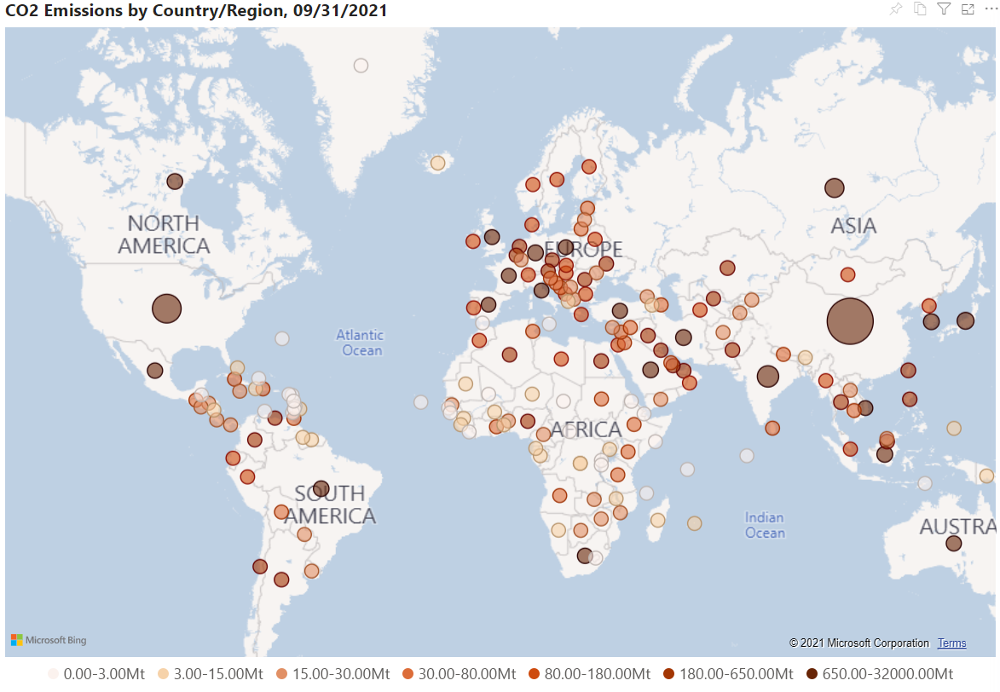

# Welcome to Carbon Insight

Carbon Insight is a platform to display the carbon neutralization roadmap for researchers, decision-makers, and other participants in the community. We provide demonstrations of cutting-edge research on carbon emission, carbon sink, and carbon flux.

With the global consensus of the 1.5°C goal of the Paris Agreement, the world has a goal to achieve carbon neutralization by 2050. This ambitious goal requires collaboration from all fields. To tackle the climate crisis together, we must first understand where carbon comes from and where it goes.

With Carbon Insight, you can work with the world's most updated carbon-related data and generate insights as you wish.

For example, in our first release, you can leverage the dataset provided by [Carbon Monitor](https://carbonmonitor.org.cn/), to have a daily anthropogenic CO2 emission estimation by country and sector since January 2019.

Carbon Insight also lets you observe and track correlations between global carbon emissions and socioeconomic factors such as COVID-19 and GDP.

Carbon Insight aims to achieve the following goals:

- Using data visualization to support scientific research, allowing researchers to identify problems and ideas that are not easily seen in conventional ways
- Acting as a tool that allows all users to explore carbon neutralization pathways under different scenarios and with technology innovations
- Illustrating data and science of carbon neutralization for the non-professionals to raise public awareness towards climate change

## Release Note

In the first release, we share:

* tutorials with code examples on how to process and analyse the Carbon Emission data
* Power BI notebooks with interactive features to filter results you are intersted in

In future, we will share more visualization and analysis results on more diverse datasets.
