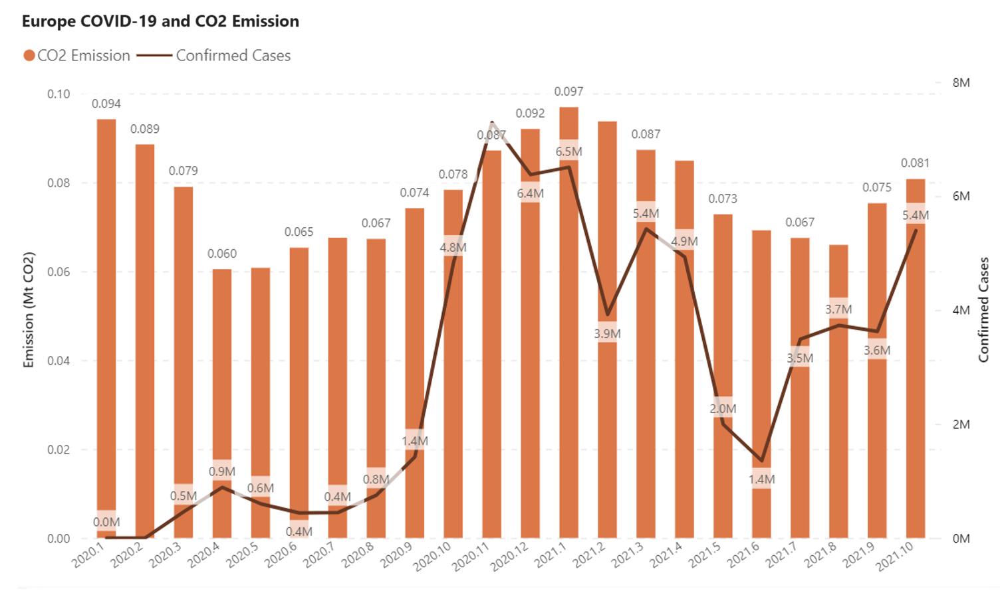
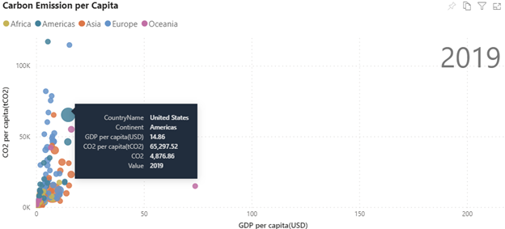

# Welcome to Carbon Insight

Carbon Insight is a platform aiming to display the carbon neutralization roadmap for researchers, decision-makers, and other participants in the community. Our mission is to visualize the world's most cutting-edge research on carbon emission, carbon sink, and carbon flux to generate insights of carbon and society. We strive to accelerate climate studies and global climate actions with computational innovations.

With the global consensus of the 1.5°C goal of the Paris Agreement, the world has a goal to achieve carbon neutralization by 2050. This ambitious goal requires collaboration from all fields. To tackle the climate crisis together, we must first understand where carbon comes from and where it goes.

With Carbon Insight, you can work with the world's most updated carbon-related data and generate insights as you wish.

Carbon Insight also lets you observe and track correlations between global carbon emissions and socioeconomic factors such as COVID-19 and GDP.

We aim to achieve the following goals:

- Using data visualization to support scientific research, allowing researchers to identify problems and ideas that are not easily seen in conventional ways
- Acting as a tool that allows all users to explore carbon neutralization pathways under different scenarios and with technology innovations
- Illustrating data and science of carbon neutralization for the non-professionals to raise public awareness towards climate change

## How to use

Using [Carbon Monitor](https://carbonmonitor.org.cn/), a dataset providing daily estimations of CO2 emissions by country/sector, as an example, we demonstrate two ways to do analysis with carbon-related data:
* interactable Power BI reports, and 
* code examples 

If you want a straightforward view of a global emission map by country, you can download our [Power BI reports](https://github.com/microsoft/Carbon-Insight/tree/main/powerbi) and filter results based on your interest.

(New to Power BI? Check the instructions on [how to download](https://powerbi.microsoft.com/en-us/downloads/) the Power BI app and [how to explore](https://docs.microsoft.com/en-us/learn/modules/explore-power-bi-service/3-navigate-content) with dashboards, reports, and apps in Power BI.)

If you have some basic coding knowledge and want to get your hands dirty customizing your own analysis or combining different datasets to scale your research, go to our [Jupyter Notebook Tutorials](https://github.com/microsoft/Carbon-Insight/tree/main/notebook) and walk through the code examples we provide on how to acquire, process and visualize carbon-related data.

## Release Note

**2022/01/06 release**:

* [Power BI reports](https://github.com/microsoft/Carbon-Insight/tree/main/powerbi) 
* [Jupyter Notebook tutorials](https://github.com/microsoft/Carbon-Insight/tree/main/notebook)

## Contributors

Carbon Insight started with a research collaboration between [MSRA](https://www.msra.cn/) and Zhu Liu's team from [Department of Earth System Science, Tsinghua University](https://www.dess.tsinghua.edu.cn/en/). We share a vision of demonstrating efforts towards carbon neutralization through visualization, benchmarking, and insightful analysis with both global consistency and local detail. Our collaboration goes wider to more areas of carbon footprint monitoring and deeper to using advanced machine learning algorithms to assist the modeling of carbon flux.

We're a fully open project and welcome contributors or collaborators from the whole community， if you wish to contribute to the project or raise suggestions, contact us at [carboninsight@microsoft.com](carboninsight@microsoft.com).

